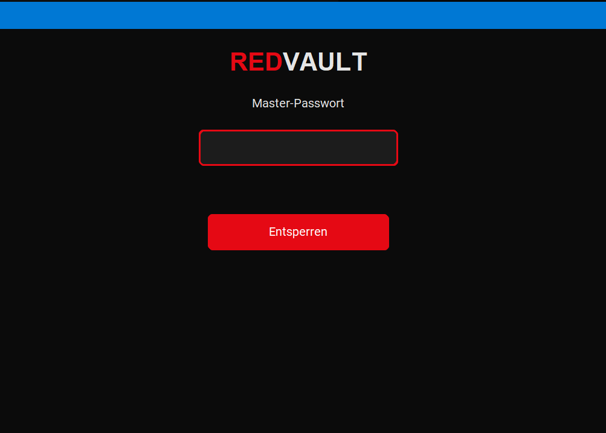
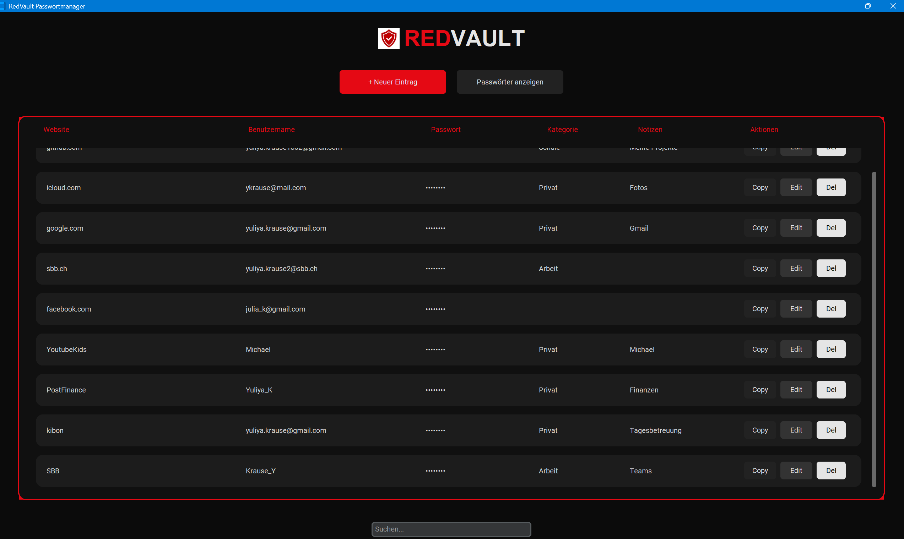
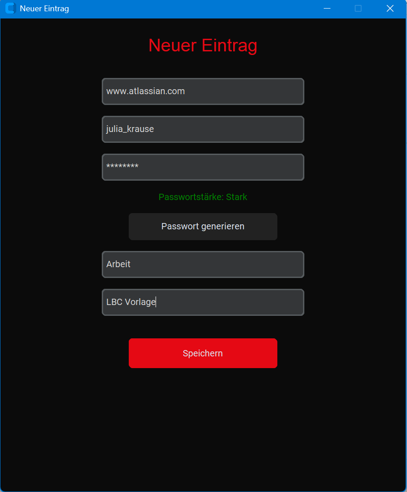
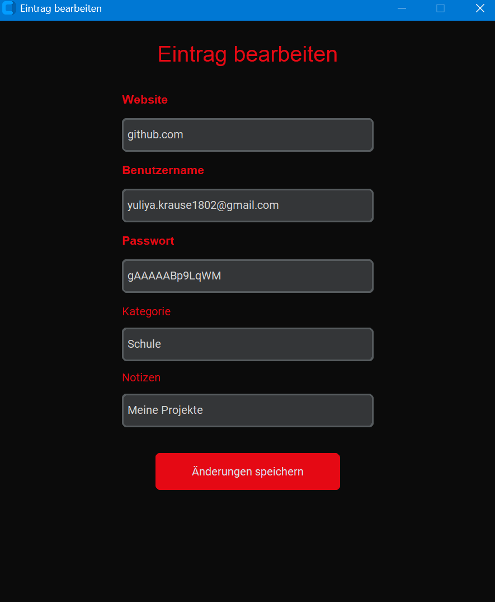
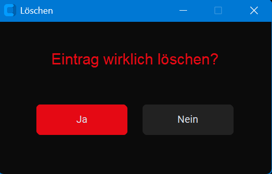

# RedVault – Password Manager

RedVault ist ein lokaler Passwortmanager für Websites, entwickelt in Python.  
Die Anwendung ermöglicht das sichere Speichern, Verwalten und Generieren von Passwörtern.

## Features

- Master-Passwort Login
- AES-verschlüsselte Passwortspeicherung
- CRUD-Funktionen für Passwort-Einträge
- Suche nach Website oder Benutzername
- Passwortgenerator
- Passwortstärke-Anzeige
- Kategorien für Einträge
- Bearbeiten bestehender Einträge
- Löschbestätigung vor dem Entfernen
- Passwortmaskierung
- Copy-to-Clipboard Funktion
- Modernes Dark-Mode UI mit CustomTkinter
- Lokale SQLite-Datenbank
- Modularer OOP-Aufbau

## Technologien

- Python 3.x
- CustomTkinter (GUI)
- SQLite (Datenbank)
- Cryptography (Verschlüsselung)
- Repository Pattern

## Architektur

Die Anwendung wurde nach OOP-Prinzipien entwickelt.

### Komponenten

- Models → Datenobjekte
- Services → Geschäftslogik
- Repository → Datenbankzugriffe
- UI → Benutzeroberfläche
- Security → Verschlüsselung & Authentifizierung

Das Projekt trennt Datenhaltung, Logik und Darstellung sauber voneinander.

## Sicherheit

- Master-Passwort wird nicht im Klartext gespeichert
- Verschlüsselung mit der Python Cryptography Library
- Sichere lokale Speicherung in SQLite
- AES-Verschlüsselung für sensible Daten
- Zugriff nur nach erfolgreichem Login

## Installation

### 1. Repository klonen
git clone https://github.com/julia1803-dev/redvault-password-manager
cd redvault-password-manager

2. Virtuelle Umgebung erstellen
python -m venv venv

3. Umgebung aktivieren
Windows:
venv\Scripts\activate

4. Abhängigkeiten installieren
pip install -r requirements.txt

▶Programm starten
py main.py

Erstes Login:
Beim ersten Start wird ein Master-Passwort eingerichtet.

Falls bereits eine lokale Datenbank `vault.db` vorhanden ist, kann diese gelöscht werden,
damit ein neues Master-Passwort gesetzt werden kann.

## Erstes Login

Beim ersten Start der Anwendung wird automatisch ein Standard-Master-Passwort erstellt.
Master-Passwort: Admin123!
Nach erfolgreicher Anmeldung können die Passwortdaten verwaltet werden.

## Projektstruktur
redvault/
│
├── app/
│   ├── database/
│   │   ├── database.py
│   │   └── password_repository.py
│   │
│   ├── models/
│   │   └── password_entry.py
│   │
│   ├── services/
│   │   ├── auth_service.py
│   │   ├── crypto_service.py
│   │   ├── password_generator.py
│   │   └── vault_service.py
│   │
│   ├── ui/
│   │   ├── dashboard_view.py
│   │   ├── login_view.py
│   ├── app.py
│   └── config.py
│   └── _init_.py
├── assets/
│   └── logo.png
│   └── Screenshot_Bearbeiten.png
│   └── Scrennshot_Dashboard.png
│   └── Screenshot_Master_Passwort.png
│   └── Screenshot_Neuer_Eintrag.png
│
├── main.py
├── README.md
├── concept.md
├── requirements.txt
├── vault.db
└── secret.key

## Geplante Erweiterungen

- Auto-Lock bei Inaktivität
- E2E-Verschlüsselung
- 2-Faktor-Authentifizierung
- Favoriten-System
- Papierkorb
- Kategorie-Auswahl als Dropdown
- Cloud-Sync
- Erstellung eigenes MasterPasswort

## Screenshots

### Login

### Dashboard

### Neuer Eintrag

### Bearbeiten

### Löschen
